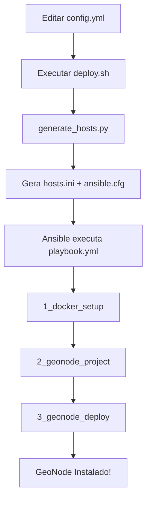

# 🚀 GeoNode Ansible - Guia Rápido

## 📋 Visão Geral

Este projeto automatiza a instalação completa do GeoNode no Ubuntu 22.04 usando Ansible. O sistema é projetado para o projeto ReNOMO e inclui configuração de Docker, criação do projeto GeoNode e deploy automatizado.

## 🏗️ Arquitetura

```
geonode_ansible/
├── config.yml          # ⚙️  Configuração central
├── playbook.yml        # 📋 Playbook principal
├── deploy.sh           # 🚀 Script de deploy
├── generate_hosts.py   # 🔧 Gerador de configurações
├── manage_env.sh       # 🌍 Gerenciador de ambientes
└── roles/              # 📁 Roles do Ansible
    ├── 1_docker_setup/     # Docker + dependências
    ├── 2_geonode_project/  # Criação do projeto
    └── 3_geonode_deploy/   # Deploy final
```

## ⚡ Início Rápido

### 1. Configuração Inicial

```bash
# Editar configurações do servidor
nano config.yml
```

**Configurações essenciais:**
```yaml
server:
  hostname: "192.168.0.151"  # IP do servidor
  user: "seu_usuario"        # Usuário SSH
  ssh_key: "~/.ssh/id_ed25519"  # Chave SSH
  sudo_password: "sua_senha"    # Senha sudo

project:
  name: "meu-geonode"        # Nome do projeto
  branch: "4.2.2"           # Versão do GeoNode
  env_type: "prod"          # Ambiente (dev/staging/prod)

passwords:
  geonode_admin: "senha_forte"     # Admin GeoNode
  geoserver_admin: "senha_forte"   # Admin GeoServer
  postgres: "senha_forte"          # PostgreSQL
```

### 2. Execução do Deploy

```bash
# Deploy completo (recomendado para VMs novas)
./deploy.sh --auto

# Ou passo a passo:
./deploy.sh --validate  # Valida configuração
./deploy.sh --run       # Executa deploy
```

## 🔧 Modos de Execução

| Comando                  | Função                        |
|--------------------------|-------------------------------|
| `./deploy.sh --validate` | Valida configuração e sintaxe |
| `./deploy.sh --dry-run`  | Verifica sintaxe sem executar |
| `./deploy.sh --run`      | Executa deploy                |
| `./deploy.sh --auto`     | Deploy completo (recomendado) |

## 📁 Descrição dos Arquivos

### **config.yml** - Configuração Central
- **Função**: Centraliza todas as variáveis do projeto
- **Seções**: Servidor, Ansible, Projeto, Rede, Senhas, Segurança, etc.
- **Ambientes**: Suporte a dev, staging e prod

### **playbook.yml** - Playbook Principal
- **Função**: Define sequência de execução das tarefas
- **Hosts**: `renomo-data1` (servidor alvo)
- **Roles**: Executa 3 roles em sequência
- **Variáveis**: Mapeia config.yml para variáveis Ansible

### **deploy.sh** - Script de Deploy
- **Função**: Automatiza todo o processo de instalação
- **Recursos**: 
  - Instala Python3 e Ansible automaticamente
  - Valida pré-requisitos e configurações
  - Gera arquivos de configuração dinamicamente
  - Múltiplos modos de execução

### **generate_hosts.py** - Gerador de Configurações
- **Função**: Gera `hosts.ini` e `ansible.cfg` dinamicamente
- **Entrada**: Lê configurações do `config.yml`
- **Saída**: Arquivos de configuração do Ansible

### **manage_env.sh** - Gerenciador de Ambientes
- **Função**: Alterna entre ambientes (dev/staging/prod)
- **Uso**: `./manage_env.sh dev|staging|prod`
- **Ação**: Copia configuração específica para `config.yml`

## 🎯 Roles do Ansible

### **1_docker_setup** - Instalação do Docker
- Atualiza sistema Ubuntu
- Instala dependências básicas
- Instala Docker e Docker Compose
- Configura usuário no grupo docker
- Configura virtualenvwrapper
- Testa instalação

### **2_geonode_project** - Criação do Projeto
- Cria ambiente virtual Python
- Instala Django
- Clona repositório geonode-project
- Cria projeto usando template Django
- Copia arquivo `.env.sample`
- Verifica criação do projeto

### **3_geonode_deploy** - Deploy Final
- Gera arquivo `.env` com configurações
- Configura PostgreSQL para acesso externo
- Executa build das imagens Docker
- Inicia containers GeoNode
- Verifica status dos serviços
- Testa conectividade HTTP

## 🔄 Fluxo de Execução



## 🌐 Acesso Após Instalação

Após o deploy bem-sucedido, você terá acesso a:

- **GeoNode**: `http://SEU_IP/`
- **GeoServer**: `http://SEU_IP/geoserver/`
- **PostgreSQL**: `psql -h SEU_IP -p 5432 -U postgres`

**Credenciais padrão:**
- **GeoNode**: admin / `sua_senha_geonode_admin`
- **GeoServer**: admin / `sua_senha_geoserver_admin`

## 🛠️ Comandos Úteis

```bash
# Monitorar logs
cd /home/seu_usuario/meu-geonode && docker-compose logs -f

# Parar containers
cd /home/seu_usuario/meu-geonode && docker-compose down

# Reiniciar serviços
cd /home/seu_usuario/meu-geonode && docker-compose restart

# Verificar status
cd /home/seu_usuario/meu-geonode && docker-compose ps
```

## ⚠️ Pré-requisitos

### **Servidor Alvo:**
- Ubuntu 22.04 LTS
- Usuário com privilégios sudo
- Acesso SSH configurado
- Conectividade de rede

### **Máquina de Controle:**
- Python 3.6+
- Ansible (instalado automaticamente pelo script)
- Acesso SSH ao servidor alvo

## 🔒 Configurações de Segurança

### **Recomendado para Produção:**
```yaml
ansible:
  host_key_checking: true  # Verificar chaves SSH

server:
  ssh_key: "~/.ssh/id_ed25519"  # Usar chaves SSH
  # sudo_password: ""  # Remover senha hardcoded

passwords:
  # Usar senhas fortes e únicas
  geonode_admin: "senha_muito_forte_123!"
  geoserver_admin: "outra_senha_forte_456!"
  postgres: "senha_postgres_forte_789!"
```

## 🐛 Solução de Problemas

### **Erro: "Arquivo .env.sample não encontrado"**
```bash
# Criar arquivo .env.sample em roles/2_geonode_project/files/
touch roles/2_geonode_project/files/.env.sample
```

### **Erro: "Ansible não encontrado"**
```bash
# O script instala automaticamente, mas se falhar:
sudo apt update && sudo apt install ansible
```

### **Erro: "Falha na conexão SSH"**
```bash
# Verificar conectividade
ping SEU_IP
ssh usuario@SEU_IP

# Verificar chaves SSH
ssh-keygen -t ed25519 -C "seu_email@exemplo.com"
ssh-copy-id usuario@SEU_IP
```

### **Erro: "Permissão negada"**
```bash
# Verificar se usuário está no grupo sudo
sudo usermod -aG sudo seu_usuario
```

## 📞 Troubleshooting

1. Verificar logs: `docker-compose logs -f`
2. Validar configuração: `./deploy.sh --validate`
3. Verificar conectividade SSH


## 📝 Notas Importantes

- **Primeira execução**: Use `./deploy.sh --auto` para instalação completa
- **Ambientes**: Configure diferentes ambientes usando `manage_env.sh`
- **Backup**: Sempre faça backup antes de atualizações
- **Senhas**: Use senhas fortes em produção
- **Monitoramento**: Monitore logs após instalação

---

**Versão**: 1.0  
**Última atualização**: 14 de outubro de 2025  
**Projeto**: ReNOMO GeoNode
